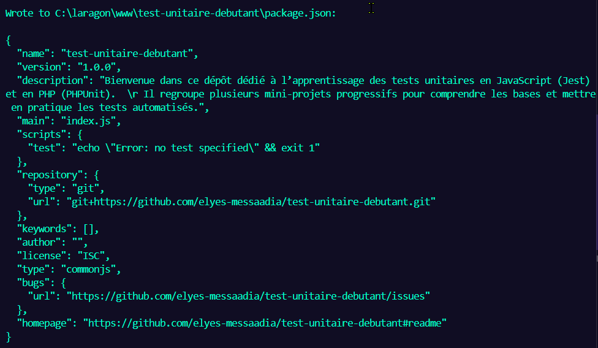
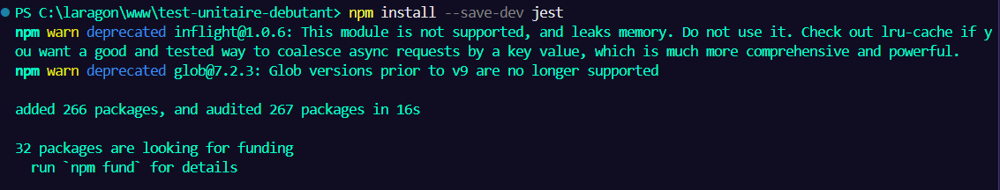
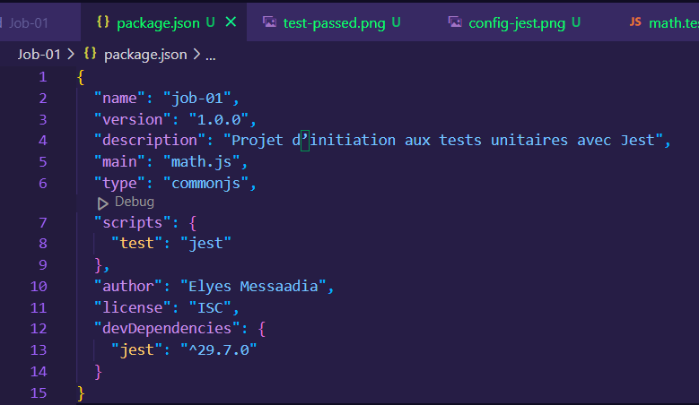
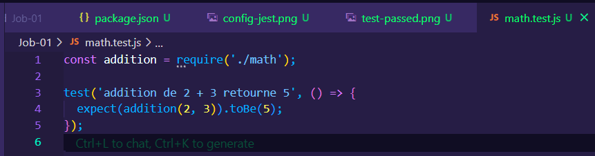
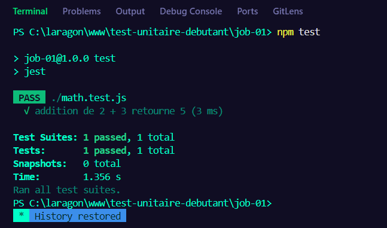
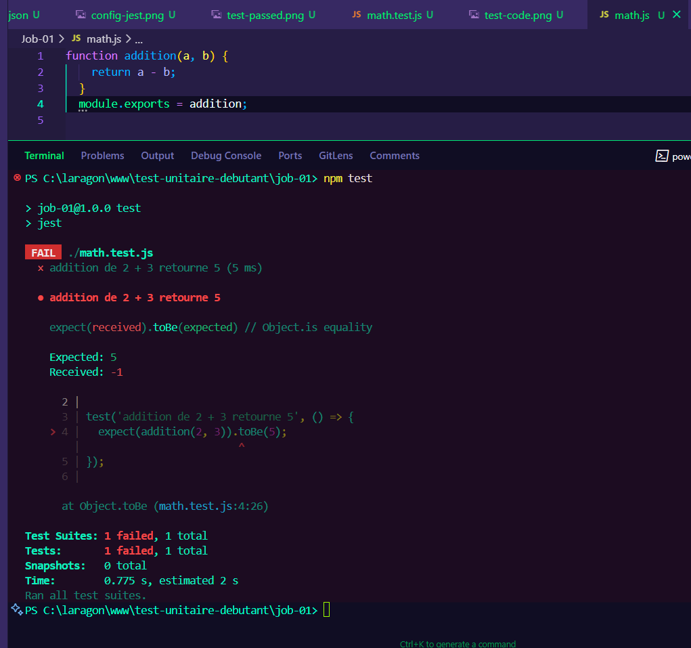
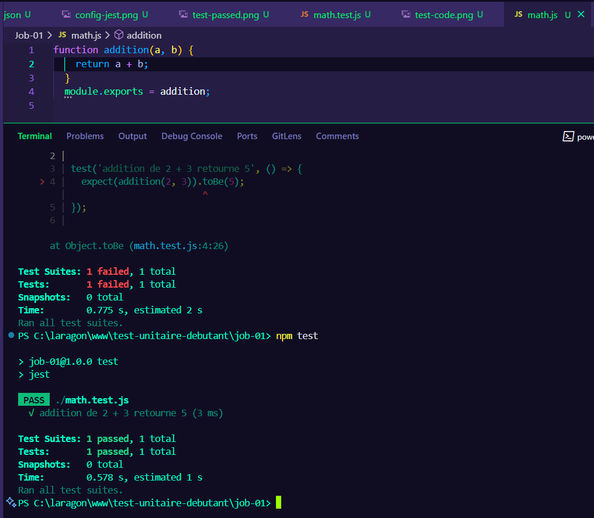
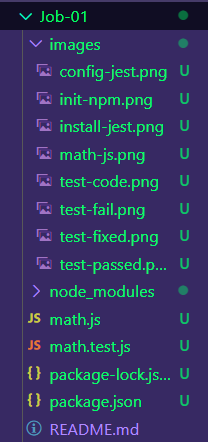

# 🧪 Job-01 – Premiers Tests Unitaires avec Jest

Bienvenue dans ce projet d’initiation aux **tests unitaires avec Jest** en JavaScript.  
Tu vas apprendre à écrire une fonction, la tester avec Jest, corriger les erreurs, et documenter tout ça comme un pro.

---

## 🎯 Objectifs

- Créer une fonction simple en JavaScript
- Écrire un test unitaire avec Jest
- Corriger une erreur de test
- Documenter chaque étape avec des captures d’écran
- Versionner le projet proprement sur GitHub

---

## 🚀 Étapes du projet

### 1. Initialiser le projet Node.js

```bash
npm init -y
```

📸 

---

### 2. Installer Jest

```bash
npm install --save-dev jest
```

📸 

---

### 3. Configurer Jest dans package.json

Ajoute ce script dans la section `"scripts"` :

```json
"scripts": {
  "test": "jest"
}
```

📸 

---

### 4. Créer la fonction `addition`

**Fichier : `math.js`**

```js
function addition(a, b) {
  return a + b;
}
module.exports = addition;
```

📸 

---

### 5. Écrire un test unitaire

**Fichier : `math.test.js`**

```js
const addition = require('./math');

test('addition de 2 + 3 doit retourner 5', () => {
  expect(addition(2, 3)).toBe(5);
});
```

📸 

---

### 6. Lancer le test avec succès ✅

```bash
npm test
```

📸 

---

### 7. Provoquer une erreur volontairement ❌

Modifie temporairement `addition` pour retourner `a - b`, puis relance le test.

📸 

---

### 8. Corriger l’erreur et revérifier ✅

Remets `a + b`, puis relance `npm test`.

📸 

---

### 9. Vue d’ensemble du projet

📸 

---

## 💬 Bonnes pratiques Git utilisées

- ✅ Commits fréquents et clairs :
  - `initialisation du projet`
  - `ajout de la fonction addition`
  - `création du test`
  - `erreur provoquée`
  - `correction et test validé`
  - `ajout des images et finalisation du README`

---

## 📚 Ressources utiles

- [Documentation Jest](https://jestjs.io/docs/getting-started)
- [Node.js](https://nodejs.org/)
- [MDN – JavaScript](https://developer.mozilla.org/fr/docs/Web/JavaScript)
- [Guide Markdown](https://www.markdownguide.org/basic-syntax/)

---

