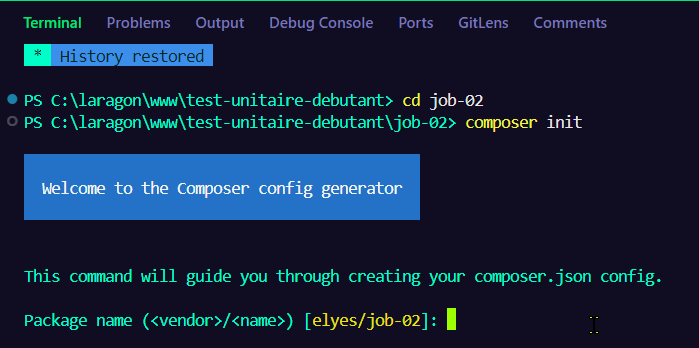
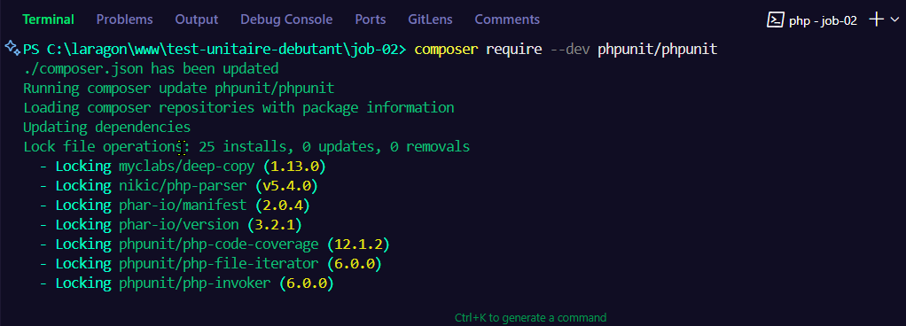
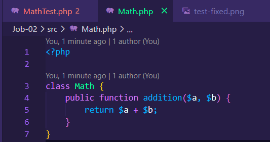
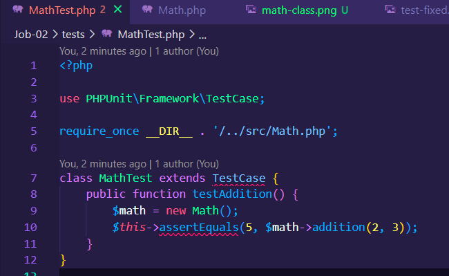
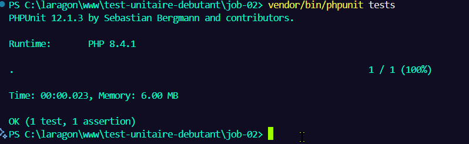
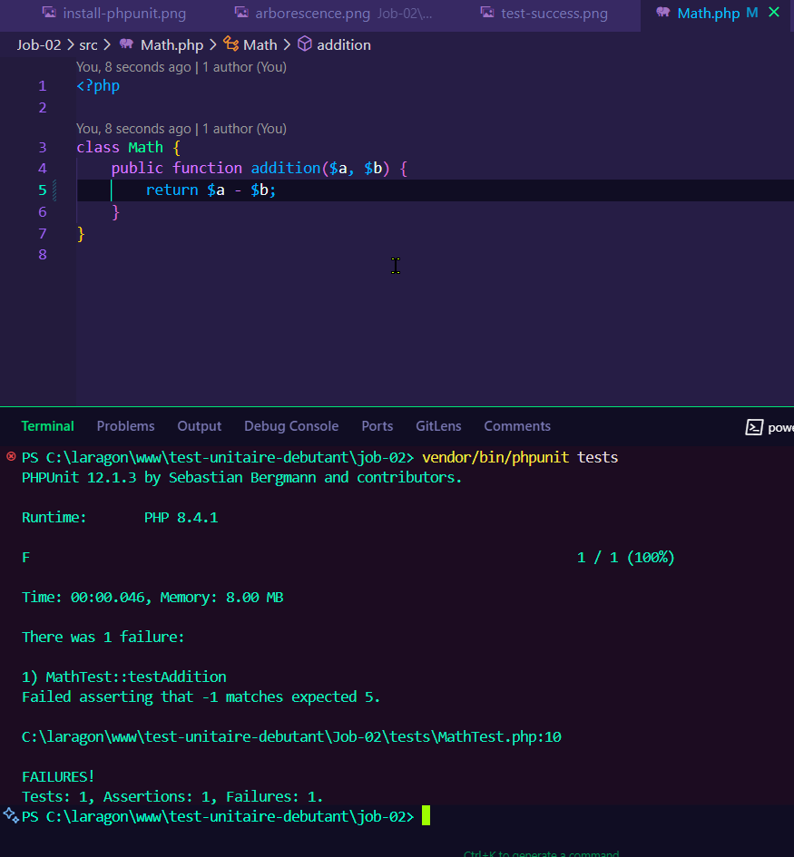
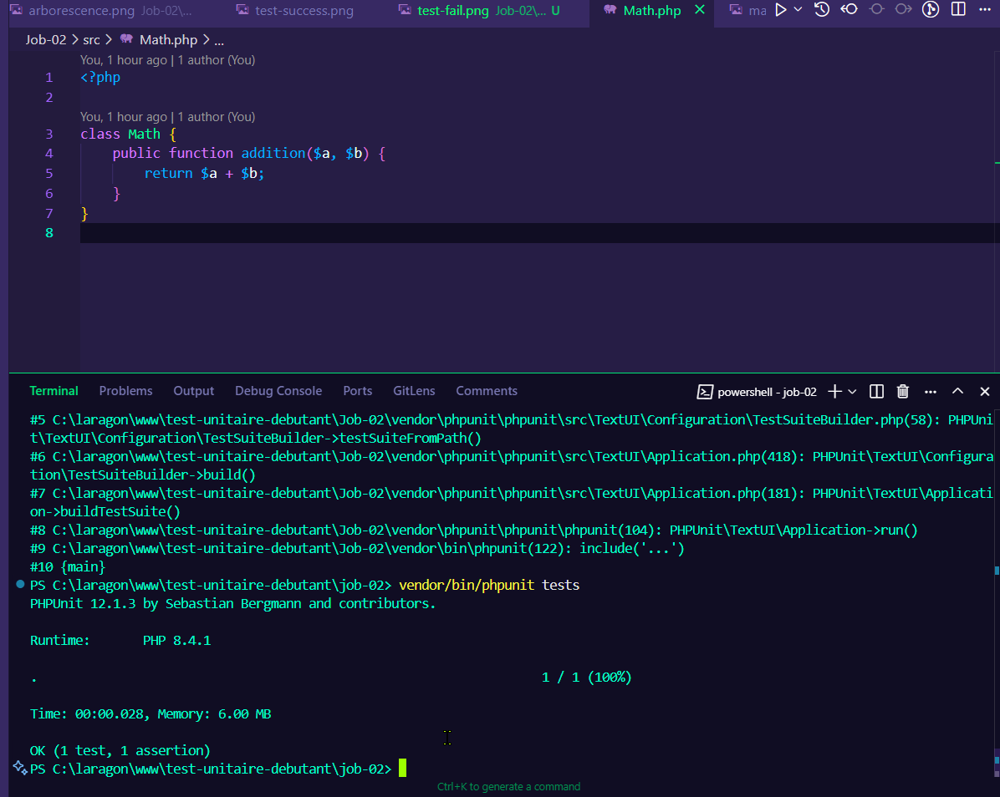
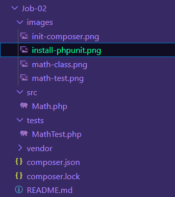

# 🧪 Job-02 – Premiers Tests Unitaires avec PHPUnit


---

## 🎯 Objectifs

- Initialiser un projet PHP avec Composer
- Créer une classe `Math` avec une méthode `addition()`
- Écrire un test unitaire avec PHPUnit
- Corriger un test en échec
- Documenter le projet avec captures d’écran
- Versionner et partager le projet sur GitHub

---

## 🚀 Étapes du projet

### 1. Initialiser Composer

```bash
composer init
```

📸 

---

### 2. Installer PHPUnit

```bash
composer require --dev phpunit/phpunit
```

📸 

---

### 3. Créer la classe `Math`

**Fichier : `src/Math.php`**

```php
<?php

class Math {
    public function addition($a, $b) {
        return $a + $b;
    }
}
```

📸 

---

### 4. Écrire un test unitaire

**Fichier : `tests/MathTest.php`**

```php
<?php

use PHPUnit\Framework\TestCase;

require_once __DIR__ . '/../src/Math.php';

class MathTest extends TestCase {
    public function testAddition() {
        $math = new Math();
        $this->assertEquals(5, $math->addition(2, 3));
    }
}
```

📸 

---

### 5. Exécuter le test (succès)

```bash
vendor/bin/phpunit tests
```

📸 

---

### 6. Provoquer une erreur volontairement

➡️ Modifie temporairement la méthode `addition()` pour retourner `a - b`.  
Relance le test pour voir l’échec.

📸 

---

### 7. Corriger la méthode et relancer le test

➡️ Rétablis `a + b` et relance PHPUnit.

📸 

---

### 8. Vue d’ensemble du projet

📸 

---

## ✅ Bonnes pratiques Git

- Commits clairs :
  - `initialisation composer`
  - `installation de phpunit`
  - `création de la classe Math`
  - `ajout du test`
  - `test échoué volontairement`
  - `correction fonctionnelle`
  - `documentation et captures ajoutées`

---

## 📚 Ressources utiles

- [PHPUnit – Documentation](https://phpunit.de/documentation.html)
- [PHP – Documentation officielle](https://www.php.net/manual/fr/)
- [Composer](https://getcomposer.org/)
- [Markdown Guide](https://www.markdownguide.org/basic-syntax/)
