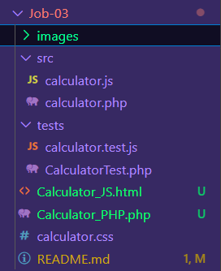
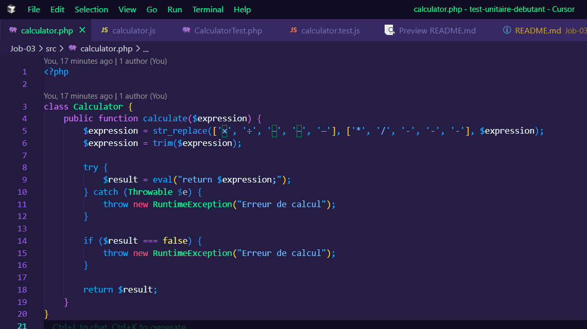
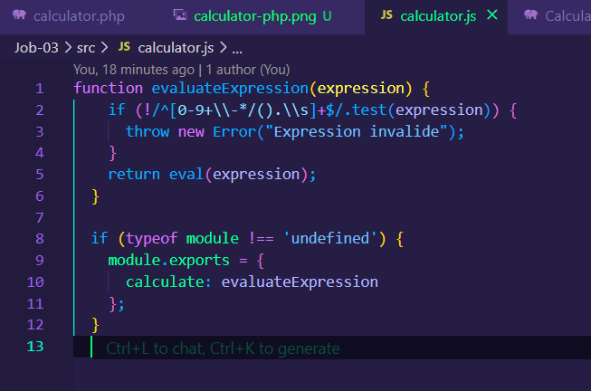
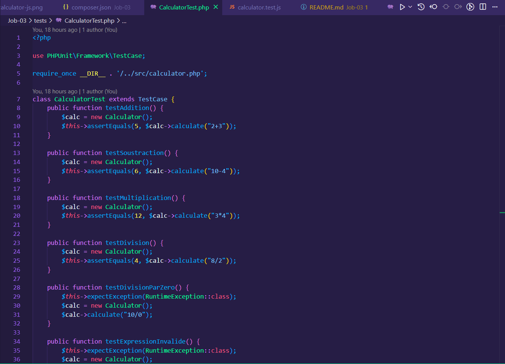
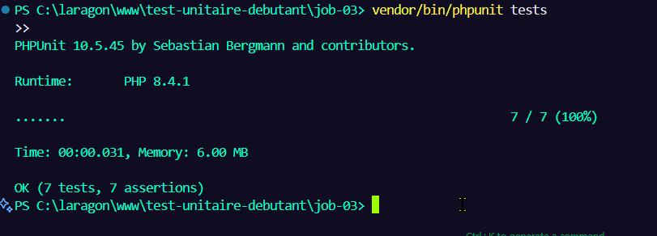
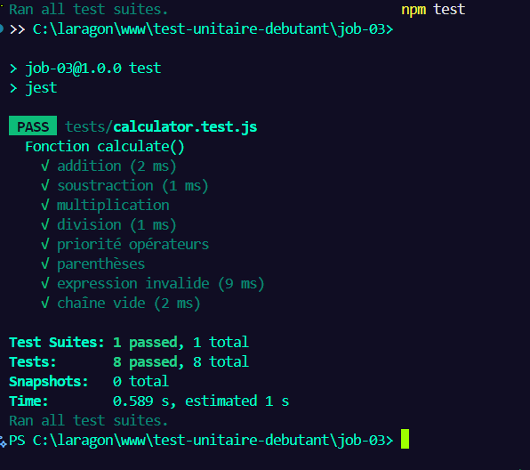

# 🧪 Job-03 – Toujours des Calculs et des Tests


---

## 🎯 Objectifs

- Écrire des tests unitaires pour une calculette PHP (classe `Calculator`)
- Écrire des tests unitaires pour une calculette JS (fonction `calculate()`)
- Tester les opérations classiques, les priorités, les erreurs
- Documenter les étapes avec des captures
- Utiliser Composer, PHPUnit, Node.js, Jest
- Structurer proprement le projet pour GitHub

---

## 🚀 Étapes du projet

### 1. Vue d’ensemble du projet

📸 

---

### 2. Code de la calculette PHP

📄 `src/calculator.php` (classe `Calculator`)

📸 

---

### 3. Code de la calculette JavaScript

📄 `src/calculator.js` (fonction `calculate()` / `evaluateExpression()`)

📸 

---

### 4. Écriture des tests PHP avec PHPUnit

📄 `tests/CalculatorTest.php`

📸 

---

### 5. Exécution des tests PHPUnit (OK ✅)

```bash
vendor/bin/phpunit tests
```

📸 

---

### 6. Écriture des tests JavaScript avec Jest

📄 `tests/calculator.test.js`

📸 

---

### 7. Exécution des tests Jest (OK ✅)

```bash
npm test
```

📸 

---

### 8. Tests échoués volontairement (KO ❌)

📸 

---

## 💬 Cas testés dans les deux versions (PHP & JS)

- ✅ `2+3` ➜ 5
- ✅ `10-4` ➜ 6
- ✅ `3*4` ➜ 12
- ✅ `8/2` ➜ 4
- ✅ `2+3*4` ➜ 14 (priorité opérateurs)
- ✅ `(2+3)*4` ➜ 20 (parenthèses)
- ❌ `"2+bad"` ➜ erreur
- ❌ `""` ➜ erreur
- ❌ `10/0` ➜ erreur (division par zéro - PHP uniquement)

---

## ✅ Bonnes pratiques Git

- Branches utilisées : `tests-php`, `tests-js`
- Commits clairs :
  - `ajout de la classe Calculator`
  - `écriture des tests PHPUnit`
  - `création de evaluateExpression()`
  - `écriture des tests Jest`
  - `ajout des captures et README`

---

## 📚 Ressources utiles

- [PHPUnit – Documentation](https://phpunit.de/documentation.html)
- [Jest – Docs](https://jestjs.io/docs/getting-started)
- [MDN – eval() JS](https://developer.mozilla.org/fr/docs/Web/JavaScript/Reference/Global_Objects/eval)
- [Composer](https://getcomposer.org/)
- [Node.js](https://nodejs.org/)
- [Guide Markdown](https://www.markdownguide.org/basic-syntax/)

---