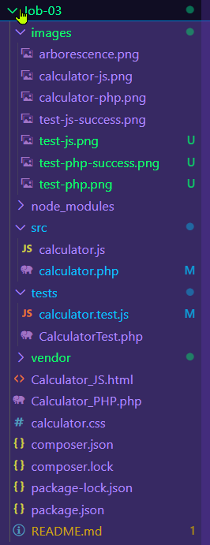
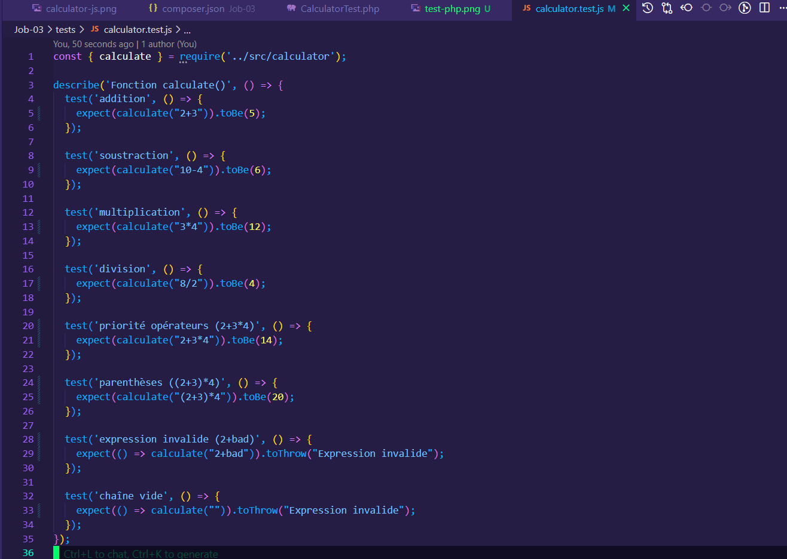

# 🧪 Job-03 – Tests Unitaires PHP & JavaScript

Ce projet a pour objectif de valider la logique de calcul de deux interfaces de calculette (PHP & JavaScript) à l'aide de tests unitaires avec **PHPUnit** et **Jest**.

---

## 📁 Structure du projet

Le projet est organisé de façon claire, avec séparation du code source, des tests, des images et des interfaces :



---

## ⚙️ Interface PHP

Le fichier `Calculator_PHP.php` utilise la classe `Calculator` pour effectuer les calculs via un formulaire.


---

## ⚙️ Interface JavaScript

L’interface HTML (`Calculator_JS.html`) utilise la fonction `evaluateExpression()` pour traiter les opérations.


---

## ✅ Tests unitaires en PHP (PHPUnit)

Les tests PHP sont définis dans `tests/CalculatorTest.php`. Chaque méthode teste un cas précis (addition, division, erreurs, etc.).


Lancement des tests PHPUnit dans le terminal :

```bash
vendor/bin/phpunit tests
```

Résultat attendu :


---

## ✅ Tests unitaires en JavaScript (Jest)

Les tests JS sont définis dans `tests/calculator.test.js` pour valider tous les cas de calcul JS.



Lancement des tests avec npm :

```bash
npm test
```

Résultat attendu :


---

## 🎯 Objectifs pédagogiques atteints

- ✅ Installer et configurer PHPUnit et Jest
- ✅ Écrire des fonctions de calcul testables
- ✅ Couvrir des cas simples et complexes
- ✅ Détecter et corriger des erreurs
- ✅ Documenter l’ensemble dans un `README.md` structuré

---

